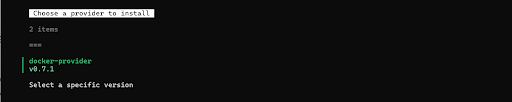
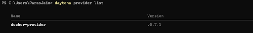
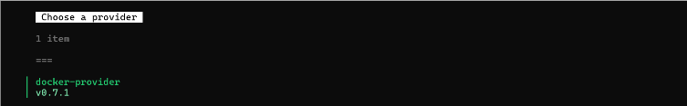
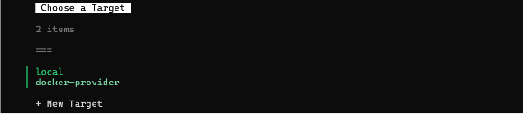
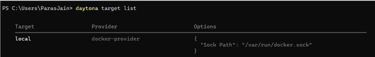
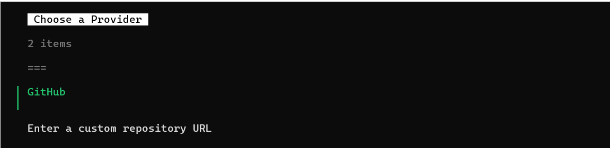
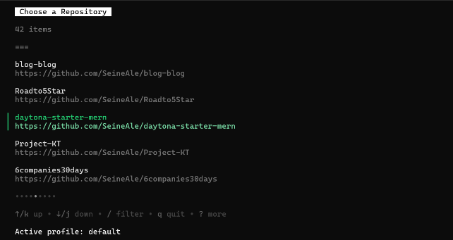
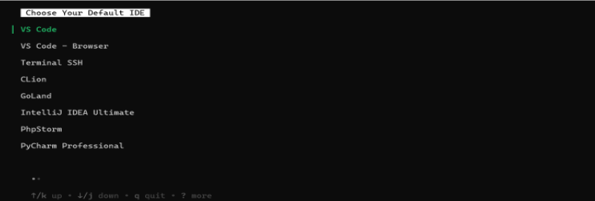
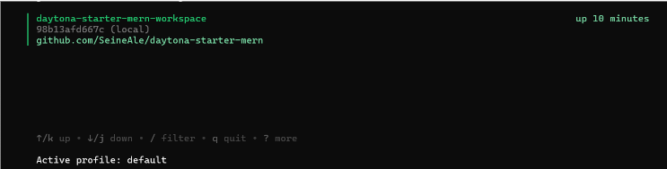

<br><br>
## Configuring MERN Stack on Your Local Machine Using GitHub and Daytona
### Introduction
Managing infrastructure to ensure smooth project delivery often involves overcoming several obstacles, particularly during the development environment setup. Frequent setup issues can disrupt developers' ability to maintain consistent, repeatable, and easily deployable workspaces across various platforms. This blog explores how Daytona streamlines Development Environment Management (DEM), providing developers with reliable workspaces free from common complications. We demonstrate how to replicate a fundamental MERN stack repository from GitHub locally using Daytona.
#### What is Daytona?
Daytona is an open-source Development Environment Manager (DEM) licensed under Apache License 2.0. It helps manage and deploy reproducible development environments using standard OCI containers. Daytona supports Dev Container standards and can support Dockerfiles, Docker Compose, Nix, and Devfile configurations. It uses project Git repository configurations to build and provision workspaces on your preferred platform. Daytona operates through a cross-platform command-line tool on Linux, macOS, and Windows systems, supporting x86-64 and AArch64 architectures, and integrates with IDEs like Visual Studio Code for project development and testing.
#### What makes Daytona so unique?
- **Security:** Daytona establishes a secure VPN connection between the client and remote machines, allowing safe access to all ports without manual port forwarding. 
- **IDE Support:** Daytona supports Visual Studio Code and JetBrains IDEs, providing a local-like development experience. 
- **SCM Integration:** Daytona can pull repositories from GitHub, GitLab, Bitbucket, and Gitea, allowing Git operations within the workspace to avoid context switching. 
- **Multi-Project Workspaces:** Daytona can create workspaces that accommodate multiple projects, making it suitable for large projects split into micro-services or multiple repositories. 
- **Reverse Proxy Support:** Daytona includes a reverse proxy to access workspaces on public or restricted networks.
- **Extensible Core:** Daytona's core is extensible with plugins developed in Go, allowing third-party providers and core functionality extensions.
### Installation
This section will guide you through installing Daytona locally on your machine. Daytona’s functionality is exposed via a versatile command-line tool compatible with Linux, macOS, and Windows operating systems and supports both x86-64 and AArch64 architectures.
#### Step 1: Install Daytona on your machine.
##### For Windows Operating Systems 
- Run the following script in PowerShell.
```powershell
$architecture = if ($env:PROCESSOR_ARCHITECTURE -eq "AMD64") { "amd64" } else { "arm64" }
md -Force "$Env:APPDATA\bin\daytona"; [System.Net.ServicePointManager]::SecurityProtocol = [System.Net.SecurityProtocolType]'Tls,Tls11,Tls12';
Invoke-WebRequest -URI "https://download.daytona.io/daytona/v0.21/daytona-windows-$architecture.exe" -OutFile "$Env:APPDATA\bin\daytona\daytona.exe";
$env:Path += ";" + $Env:APPDATA + "\bin\daytona"; [Environment]::SetEnvironmentVariable("Path", $env:Path, [System.EnvironmentVariableTarget]::User);
```

##### For Linux / Mac Operating Systems
- Pre-requisites: A POSIX-compatible shell such as bash or sh.
- Official Installation Script:
```sh
(curl -sf -L https://download.daytona.io/daytona/install.sh | sudo bash) && daytona server -y && Daytona
```
You can also install Daytona using Homebrew and Nix. Refer to the official installation guide for more information.
#### Step 2: Start the Daytona server
- Run the following command to start the Daytona server.<br>
Pre-requisite: Docker must be  installed and running in your system
```sh
daytona serve
```
#### Step 3: Start Developing
- Let the server run and switch the Powershell. Run the following command on a new PowerShell tab.
```sh
daytona
```
<br><br>
 After executing the command, you should see Daytona’s Logo and all the available CLI commands. If yes, congratulations! Daytona has been successfully installed and is running on your local machine.

### Add GitHub as a Git provider.
Git providers, sometimes known as software forges or Source Code Managers (SCMs), offer tools for hosting and collaborating on codebases using Git. Daytona allows you to configure these Git providers and create workspaces using repositories hosted on them. Daytona supports multiple Git providers, such as GitHub, GitLab, and Bitbucket.

This section will set up GitHub as our Daytona Git provider. Configuring GitHub as your Git provider will enable you to access your remote GitHub repository through Daytona.

#### Step 1: Add a new Git provider
- Run the following CLI command to start the process

```sh
daytona git-providers add
```

This should list all the Git providers that Daytona supports. For now, we will choose GitHub as our Git provider.

#### Step 2: Give Daytona access to your GitHub
- Enter the GitHub personal access token

After selecting GitHub as a Git provider, you will be asked to enter the GitHub personal access token. If you do not have one, refer to this [official guide](https://docs.github.com/en/authentication/keeping-your-account-and-data-secure/creating-a-personal-access-token) to generate the token and enter it when prompted.

**Note:** Your GitHub personal access token is highly confidential. Make sure you keep it safe and protected.

### Install a “Provider”
Provider is a plugin that interfaces with the Daytona server. The Daytona Server communicates with Providers to execute Workspace creation and lifecycle management operations. Examples of platforms Providers may connect with include: 

- Container management platforms such as Docker or Podman 
- Cloud hosting providers such as AWS or DigitalOcean.

#### Daytona Provider Docker:
After installation, Daytona installs a provider for Docker `daytona-docker-provider` by default.

#### Step 1: Install a new Daytona provider.
- Execute the following command:

```sh
daytona provider install
```

#### Step 2: Select the default docker-provider.
<br><br>

#### Step 3: Check if the provider is installed.
- Execute the following command:

```sh
daytona provider list
```

Executing this command will list all the available targets, so make sure your target is on the list.<br>
<br><br>

### Set a “Target”
After successfully Installing a provider, we will set a target. Target is a set of configuration that governs how Daytona manages and deploys Workspaces. Each Target is tied to an individual Provider. Daytona allows you to configure new and existing Targets, and choose between them at Workspace creation time. 

#### Step 1: Set a new target 
- Execute the following command to set a target.

```sh
daytona target set
```

#### Step 2: Choose a provider for your target.
Daytona will list all the installed providers from which you can choose. For simplicity, we will go with the default docker-provider for now.<br>
<br><br>

#### Step 3: Choose the default local docker target.
When using Docker as a provider, you can create a local or remote target. By default, Daytona is pre-configured with a local Docker target. This local target utilizes your local Docker installation to deploy workspaces, enabling you to use Daytona without needing external servers or infrastructure. This setup simplifies the deployment process and allows you to manage workspaces efficiently on your local machine.<br>
<br><br>

#### Step 4: Specify sock path
Unless otherwise configured after installing Docker, this sock path should be set to the default value `/var/run/docker.sock`.

#### Step 5: Check if the target is set
- Execute the following command:

```sh
daytona target list
```

Executing this command will list all the available targets, so make sure your target is on the list.<br>
<br><br>

### Create a Workspace
Workspaces contain your project’s codebase, dependencies and packages, and configuration. Daytona allows you to create workspaces for various Git Providers. Workspaces can be created from a configured Git provider or from an arbitrary Git URL.

#### From GitHub
- Execute the following command:

```sh
daytona create
```

- Choose GitHub as the Git provider:<br>
<br><br>

- Choose a repository from your GitHub
After selecting GitHub as a Git provider, Daytona will list all your GitHub account's repositories, including private ones. You can choose any one of them and continue creating your workspace.<br>
<br><br>

- Enter a name for your workspace.
Make sure to choose an identifiable and unique name for your workspace.

#### From an arbitrary Git URL
- Execute the following command:

```sh
daytona create <Git URL>
```

- Your workspace is ready.
The workspace will be created, and you will be prompted with details of the workspace, including:
- Name of the workspace
- The ID of your workspace
- Default IDE (Customizable)
- URL of the remote repository

### Set a preferred IDE 
Daytona allows you to connect to your Workspace using your preferred IDE. You can set the default IDE used by Daytona. After setting the default IDE, it will be opened automatically and connected to your Workspace when using the `daytona code` command.

- Execute the following command:

```sh
daytona ide
```
<br><br>
After executing the command, Daytona will list all the supported IDEs. You can choose any IDE from the list and set it as default for the future. For now, we will choose VS Code as the default IDE, but you can change the default IDE anytime in the future just by following the same process again.

### Open the workspace
#### Step 1:Choose a workspace to open.
- Execute the following command:

```sh
daytona code
```

A list of already created workspaces will appear. Choose a workspace from the list, and Daytona will open the selected workspace in your default IDE.<br>
<br><br>
#### Exploring devcontainr.json
A devcontainer.json file is a configuration file used by Visual Studio Code (VS Code) to define a consistent development environment using containers. It is part of the Visual Studio Code Remote - Containers extension, which allows you to open any folder inside a container and take advantage of the container's isolated and reproducible environment.<br>
Here are the details of the devcontainer.json file used in this project:
```json
{
    "name": "Node.js, Express, React, MongoDB & Tailwind",
    "image": "mcr.microsoft.com/vscode/devcontainers/javascript-node:20",
    "workspaceFolder": "/workspaces/${localWorkspaceFolderBasename}",

    "portsAttributes": {
        "5174": {
            "label": "Frontend",
            "onAutoForward": "openPreview"
        },
        "8000": {
            "label": "Backend",
            "onAutoForward": "openPreview"
        },
        "27017": {
            "label": "MongoDB",
            "onAutoForward": "ignore"
        }
    },

    "customizations": {
        "vscode": {
            "extensions": [
                "mongodb.mongodb-vscode",
                "dbaeumer.vscode-eslint",
                "esbenp.prettier-vscode",
                "bradlc.vscode-tailwindcss",
                "davidanson.vscode-markdownlint"
            ]
        }
    },
    "postCreateCommand": "echo 'package-import-method=clone-or-copy' >> ~/.npmrc && npm install -g npm@10.8.1 nodemon && cd backend && npm install --unsafe-perm && cd ../frontend && npm install --unsafe-perm",

    "remoteUser": "root"
}
```

You can find this devcontainer.json file inside .devcontainer folder in root directory
#### Step 2: Rebuild the container.
- Rebuild and reopen in container.<br>
**Pre-requisite:** You must have Microsoft's Devcontainer extension preinstalled in Visual Studio Code.<br>
In the command panel, type `rebuild and reopen in container` and wait for all the processes to complete. Now you can start the development process as usual.<br>
<br><br>
- Navigate to the backend directory and execute the following command:

```sh
npm run dev
```

- Navigate to the frontend directory and execute the following command:

```sh
npm run dev
```
