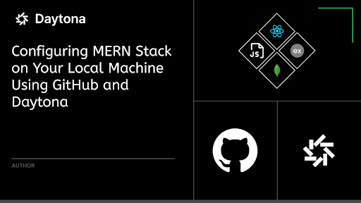
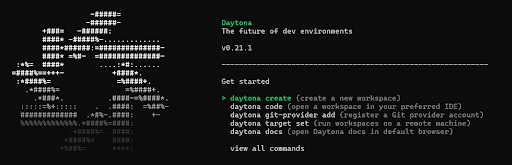
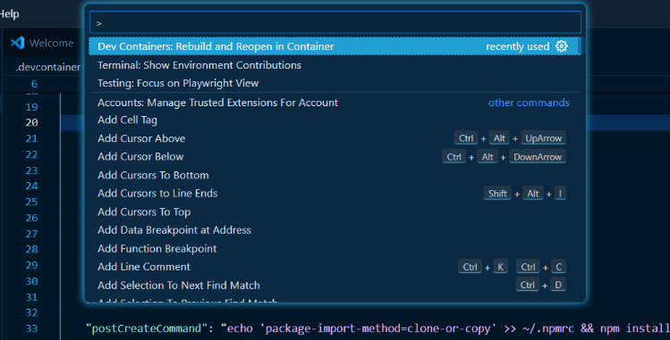

<br><br>
## Configuring MERN Stack on Your Local Machine Using GitHub and Daytona

### Introduction
Managing infrastructure to ensure smooth project delivery often involves overcoming numerous obstacles, particularly during the development environment setup. Frequent setup issues can hinder developers' ability to maintain consistent, repeatable, and easily deployable workspaces across various platforms. This guide examines how Daytona simplifies Development Environment Management (DEM), offering developers reliable workspaces that avoid common complications. It contrasts how to replicate a simple MERN stack repository locally from GitHub with and without Daytona.

### Technologies used
- **Daytona**
- **Docker**
- **Node.js**

#### Backend Libraries and Frameworks
- **Express**: A minimalist web framework for Node.js to create robust APIs.
- **MongoDB**: A NoSQL database for storing and retrieving data efficiently.
- **Mongoose**: An ODM library for MongoDB, simplifying data modeling and validation.
- **Cors**: Middleware to enable Cross-Origin Resource Sharing for the backend API.
- **Dotenv**: Module to load environment variables from a `.env` file into `process.env`.
- **Nodemon**: A tool that automatically restarts the Node.js application when file changes are detected.

#### Frontend Libraries and Frameworks
- **React**: A JavaScript library for building user interfaces.
- **Recoil**: A state management library for React applications.
- **Axios**: A promise-based HTTP client for making API requests.
- **Vite**: A build tool that provides a fast development server and optimized builds.
- **TailwindCSS**: A utility-first CSS framework for quickly designing responsive and modern layouts.

### Setting up the project without Daytona

In this section, we will set up this repository locally without Daytona.

#### Step 1: Clone the Git Repository Locally
- Open your terminal or command prompt and clone the repository using the following command:
```bash
git clone <repository_url>
```
#### Step 2: Install Node.js
- To check if Node.js is installed, open a terminal or command prompt and run:
```bash
node --version
```
- If Node.js is not installed on your machine, download it from [Node.js official website](https://nodejs.org/) and follow the installation instructions specific to your operating system.

- Adding Node.js to the system path

  **Windows**
  - Open the Settings and search for "Environment Variables".
  - Click on the "Environment Variables" button.
  - Select the "Path" variable.
  - Click on the "Edit" button.
  - In the Edit Environment Variable screen, click the "New" button.
  - Add an entry: `.\node_modules\.bin`.

  **Linux / MacOS:** execute the following command:
```bash
export PATH=$PATH:/usr/local/nodejs/bin
```
#### Step 3: How to Start the Backend Server
- Navigate to the `backend` directory within the cloned repository and run:
```bash
npm install
```
- Create a `.env` file in the `backend` directory and add the following line:
```
MONGO_URI="Your Database Connection String"
```
- Start the backend server by running:
```bash
npm run dev
```

#### Step 4: How to Start the Frontend
- Navigate to the `frontend` directory within the cloned repository and run:
```bash
npm install
```
- Create a `.env` file in the `frontend` directory and add the following line:
```
VITE_BACKEND_URL="http://localhost:8000/api/customers/"
```
- Start the frontend development server by running:
```bash
npm run dev
```
  Your React app should now be up and running.

### Problems with Conventional Setup

- **Dependency Management**: Conflicts, version mismatches, and inconsistencies.
- **Time Consumption**: Diverts focus from coding to setup tasks.
- **Collaboration Difficulties**: Ensuring consistent environments across team members.
- **Security Risks**: Vulnerabilities in manually configuring secure access and VPNs

### How Daytona Helps

Daytona automates the entire process, addressing these issues effectively:

- **Automated Provisioning**: Automatically provisions and configures environments.
- **Prebuilds and Secure Connections**: Sets up prebuilds and secure VPN connections.
- **Seamless IDE Integration**: Connects securely to local or Web IDEs like Visual Studio Code and IntelliJ IDEA
- **Easy Sharing and Collaboration**: Assigns a fully qualified domain name for easy sharing.
- **Reproducible Environments**: Uses OCI containers and supports Dev Container standards, ensuring consistency.
- **Cross-Platform Support**: Works on Linux, macOS, and Windows, supporting x86-64 and AArch64 architectures.

### Setting up the project using Daytona

#### Step 1: Install Daytona
- Ensure Docker is installed and running, then execute:

##### For Windows
- Run the following script in PowerShell:
```powershell
$architecture = if ($env:PROCESSOR_ARCHITECTURE -eq "AMD64") { "amd64" } else { "arm64" }
md -Force "$Env:APPDATA\bin\daytona"; [System.Net.ServicePointManager]::SecurityProtocol = [System.Net.SecurityProtocolType]'Tls,Tls11,Tls12';
Invoke-WebRequest -URI "https://download.daytona.io/daytona/v0.21/daytona-windows-$architecture.exe" -OutFile "$Env:APPDATA\bin\daytona\daytona.exe";
$env:Path += ";" + $Env:APPDATA + "\bin\daytona"; [Environment]::SetEnvironmentVariable("Path", $env:Path, [System.EnvironmentVariableTarget]::User);
```

##### For Linux / macOS
- Run the following script:
```sh
(curl -sf -L https://download.daytona.io/daytona/install.sh | sudo bash) && daytona server -y && daytona
```
- Alternatively, you can use Homebrew or Nix for installation. Refer to the official installation guide for more options.
<br><br>

#### Step 2: Configure GitHub as a Git Provider

- Add a New Git Provider and select GitHub from the list.
```sh
daytona git-providers add
```
- Enter GitHub Personal Access Token
Generate a token, if you do not have one, by following [this guide](https://docs.github.com/en/authentication/keeping-your-account-and-data-secure/creating-a-personal-access-token) and enter it when prompted.

#### Step 3: Install a Provider
- Run the following command and select the Default Docker Provider.
```sh
daytona provider install
```

#### Step 4: Set a Target

- Set a New Target:
```sh
daytona target set
```
- Select the Docker provider and set the default local Docker target. Specify the sock path as `/var/run/docker.sock`.

- Verify the Target by executing the following command:
```sh
daytona target list
```

#### Step 5: Create a Workspace

##### From GitHub
- Execute the following command:
```sh
daytona create
```
- Select GitHub and choose a repository. Name your workspace.

##### From a Git URL
- Execute the following command:
```sh
daytona create <Git URL>
```

#### Step 6: Set a Preferred IDE
- Execute the following command to list all the supported IDEs.
```sh
daytona ide
```
- We will focus on Visual Studio Code for now.

#### Step 7: Open the Workspace

- Choose a Workspace by executing following command:
```sh
daytona code
```
#### Step 8: Rebuild and Reopen in container
**Pre-requisite:** You must have Microsoft's Dev Containers extension preinstalled in Visual Studio Code.<br>
- press `ctrl + shift + p` and choose "Dev Containers: Rebuild and Reopen in Container".<br>
<br><br>

#### Step 9: Start the Development Servers

**Backend**
- Navigate to the backend directory and create a `.env` file in the `backend` directory and add the following line:
```
MONGO_URI="Your Database Connection String"
```
- Execute the following command to start the backend server:
```sh
npm run dev
```
**Frontend**
- Navigate to the frontend directory and create a `.env` file in the `frontend` directory and add the following line:
```
VITE_BACKEND_URL="http://localhost:8000/api/customers/"
```
- Execute the following command to start the frontend server:
```sh
npm run dev
```
We saw how Daytona simplifies and automates the setup process, ensuring consistent and secure development environments, thereby streamlining and reducing the complexities of development.

### How Daytona Simplifies Development Environments

Daytona streamlines the process of setting up development environments by leveraging a `.devcontainer` folder. This folder contains configuration files that ensure all necessary dependencies and plugins are installed and configured correctly, providing a consistent and hassle-free setup.

#### The `.devcontainer` Folder and `devcontainer.json`

The `.devcontainer` folder includes a `devcontainer.json` file that specifies the configuration for the development environment. This file covers the base image, workspace folder settings, port forwarding, and additional customizations.

#### `devcontainer.json` Configuration

Here are the details of the `devcontainer.json` file used in this project:

```json
{
    "name": "Node.js, Express, React, MongoDB & Tailwind",
    "image": "mcr.microsoft.com/vscode/devcontainers/javascript-node:20",
    "workspaceFolder": "/workspaces/${localWorkspaceFolderBasename}",
    "portsAttributes": {
        "5174": {
            "label": "Frontend",
            "onAutoForward": "openPreview"
        },
        "8000": {
            "label": "Backend",
            "onAutoForward": "openPreview"
        },
        "27017": {
            "label": "MongoDB",
            "onAutoForward": "ignore"
        }
    },
    "customizations": {
        "vscode": {
            "extensions": [
                "mongodb.mongodb-vscode",
                "dbaeumer.vscode-eslint",
                "esbenp.prettier-vscode",
                "bradlc.vscode-tailwindcss",
                "davidanson.vscode-markdownlint"
            ]
        }
    },
    "postCreateCommand": "echo 'package-import-method=clone-or-copy' >> ~/.npmrc && npm install -g npm@10.8.1 nodemon && cd backend && npm install --unsafe-perm && cd ../frontend && npm install --unsafe-perm",
    "remoteUser": "root"
}
```

#### Key Features

##### Base Image
- **Base Image:** Uses `mcr.microsoft.com/vscode/devcontainers/javascript-node:20` for a consistent environment. This base image provides a pre-configured Node.js environment, ensuring that all necessary dependencies and tools for Node.js development are available right out of the box. It simplifies the setup process by including common development utilities and ensuring compatibility with the specified Node.js version.

##### Workspace Folder
- **Workspace Folder:** Maps the local workspace folder to the container, ensuring that the development environment is consistent across different machines and setups.

##### Port Forwarding
- **Port Forwarding:** Configures ports for frontend, backend, and MongoDB services with specific labels and behaviors, making it easier to manage and access these services during development.

##### Customizations
- **Customizations:** Installs essential Visual Studio Code extensions automatically:
  - MongoDB, ESLint, Prettier, Tailwind CSS, and Markdown linting.

##### Post Create Command
- **Post Create Command:** Runs commands after container creation to set npm configurations and install dependencies for both backend and frontend, ensuring that the development environment is ready to use immediately.

##### Remote User
- **Remote User:** Sets the user to `root` for necessary permissions, which can be adjusted as needed.

By leveraging the `.devcontainer` folder and `devcontainer.json`, developers can enjoy a consistent, automated, and fully-featured development environment, allowing them to focus on coding.


